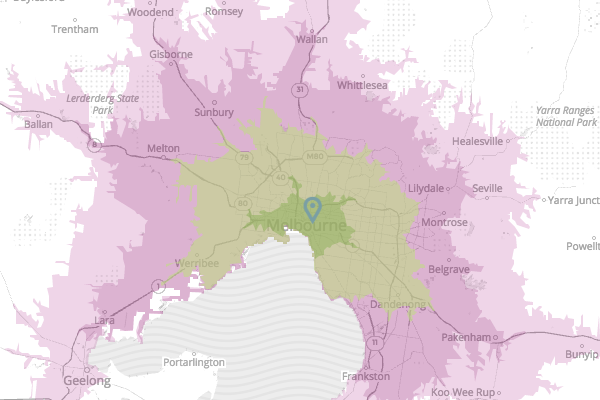

# Generate isochrones

By calculating isochrones in [Mobility Explorer](https://mobility-explorer.netlify.com), you can view where you can travel from a point, such as a transit stop, within a certain amount of time. You can specify the mode of transportation, such as walking, biking, driving, or taking transit, and see a series of rings to represent where you can reach within various increments of time, ranging from 15 to 60 minutes.

This is an example of isochrones showing the travel times by driving from a location in Melbourne, as depicted in Mobility Explorer.

Isochrone functionality is also sometimes referred to as a service area, a drive-time analysis to show where you can drive from a point within a certain time, or a walkshed. A walkshed, which is a transportation planning term, calculates an area within a range of a location that can be reached by walking (or a bikeshed for areas that can be traveled by bicycle within those time ranges).

The analysis comes from the [Valhalla Isochrone](https://github.com/valhalla/valhalla-docs/blob/master/isochrone/api-reference.md) service, which you can use as an API in your own apps.

1. Search for a place in the box or click a location on the map. You need to have a point on your map to generate isochrones.
2. Click `Generate isochrones`.
3. Choose a mode of transportation. For example, click `walking` to see how far you can walk within intervals of 15 to 60 minutes.
  If you are generating isochrones for transit, you need to set the date and time of your departure. You can also choose whether to include or exclude certain operators or routes.
4. The map updates with isochrone areas drawn around the point. Move the point around the map to calculate isochrones from that location.
5. You can click `See the Valhalla API request for these results` to view the raw API request in your browser’s address bar and resulting JSON response from the server
6. Click the clear button on the search box to remove the pin and any isochrones from the map.

## Data credits

The images are from Mobility Explorer, which includes data from [Transitland](https://transit.land) and [OpenStreetMap](http://www.openstreetmap.org/).
