# Explore transit routes, stops, and travel times

[Mobility Explorer](https://mobility-explorer.netlify.com) highlights the connections between transportation datasets, including among different transportation modes and operators. In this tutorial, you will use Mobility Explorer to ask questions about routes and stops, filter the kinds of transit data displayed on a map, and view travel times from a place. You can use these queries to build a custom transit map.

You will use Mobility Explorer to query and visualize transit data from [Transitland](https://transit.land), a community-edited, open transit data aggregation project that Mapzen sponsors, and analyze access using other Mapzen Mobility services, including [Valhalla Isochrone](https://github.com/valhalla/valhalla-docs/blob/master/isochrone/api-reference.md).

You can follow along with the location example used in the tutorial, or choose your own address or place to view transit in that area.

To complete the tutorial, all you need is a browser and an internet connection while you are working. No special knowledge of coding or transit data is needed. The tutorial should take about an hour to complete.

## Get to know Transitland data

[Transitland](https://transit.land) is an open-source database of transit information, and brings together many sources of transit data to build a directory of operators and feeds that can be edited by transit enthusiasts and developers. Transitland is the source of transit data you see and query in Mobility Explorer, as well as the multimodal routing for [Valhalla Turn-by-Turn](https://github.com/valhalla/valhalla-docs/blob/master/turn-by-turn/overview.md).

Transitland aggregates publicly available transit datasets that use the [General Transit Feed Specification](https://developers.google.com/transit/gtfs/), which is a common way of organizing transit schedules, routes, and associated content. A GTFS feed consists of a .zip file that contains a series of specific text files with this information. Transitland has several components to it, including Feed Registry and Datastore.

- [Feed Registry](https://transit.land/feed-registry/) is a directory of transit operators and GTFS data feeds. Through the Feed Registry, you can browse operators, feeds, and usage and license information, as well as contribute additional feeds or browse the data on a map or in Mobility Explorer. You can search for certain operators or locations to filter the results.
  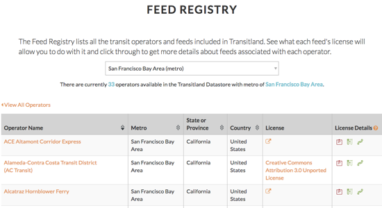

- [Datastore](https://transit.land/documentation/datastore/) is the web service API that powers the Feed Registry and other views into Transitland data. Datastore imports the contents of GTFS feeds, merges new records with existing records, allows edits and fixes, and provides an API for further querying and editing.
  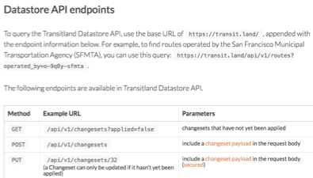

Mobility Explorer is actually a view into Datastore, allowing you to query the data using a user interface and see the results on a map.

## View public transit networks

Now that you have seen the source data in Transitland, you can better understand the origins of the data you see in Mobility Explorer. You will first see which transit operators, or agencies, provide service in Oakland, California, and explore transit routes and stops in a later exercise.

Each query or map update is maintained as a separate URL, which means that you can return to your previous map by clicking the back button in your browser window. You can also share this URL with others and they will see the same results that you see.

1. In your browser, go to https://mobility-explorer.netlify.com/. Mobility Explorer opens to a default location, with a map on the right and a sidebar on the left where you can visualize and analyze transit data.
2. In the search box on the map, type `Oakland, CA`. The search box uses [Mapzen Search](https://mapzen.com/products/search/geocoding), Mapzen's open-source geocoder, and the text automatically completes as you type. When you press Enter, the map extent updates and adds a pin in Oakland.
3. On the left, under `Visualize public transit networks`, click `Show Operators`. This shows polygons representing the area served by each operator. Essentially, each polygon is created to surround all of the stop locations served by a given operator.
  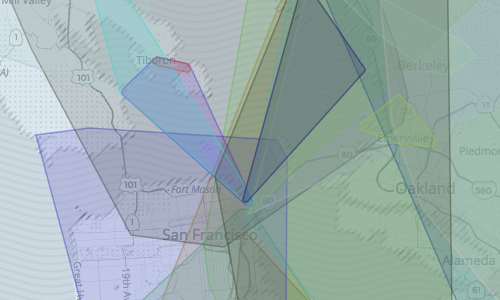
4. Hover over the polygons on the map to see the operator name.
  Sometimes, it can be hard to get information about a polygon because it is overlapped by other polygons. You can use the drop-down list of operators choose a particular one.
5. Click the drop-down list of operators and click `Bay Area Rapid Transit (BART)`, which is a metro network, to see where this operator serves.
  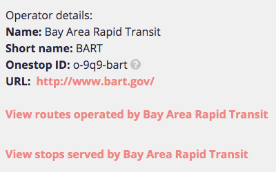
  The sidebar shows details about the operator, including its name and website, and something called a Onestop ID. Under the operator details, there are also links to view the routes and stops for this operator.
  A [Onestop ID](https://transit.land/documentation/onestop-id-scheme/) is a unique identifier from Transitland that helps label and connect data about public transit that are coming from many agencies. BART's Onestop ID is `o-9q9-bart`, with the first letter `o` indicating it is identifying an `operator`.
6. Zoom out so you can see the entire BART polygon by using the buttons on the map or your mouse wheel.
7. Click `View routes operated by Bay Area Rapid Transit` on the sidebar. Behind the scenes, this is querying the Datastore API for the transit route lines. In addition, when you do this, Mobility Explorer expands the `Show routes` section.
8. Explore BART's routes by hovering over a line on the map. The colors of the lines are listed in the source GTFS data, and are used to display the lines in Mobility Explorer. _Note: Right now, the route lines overlap each other, yet they should be offset so you can see all of them at once._
  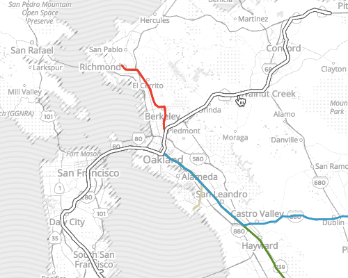
9. Look in the `Show routes` section for the name of the route. If you click a route on the map or in the drop-down list, you can get even more information about the route.
  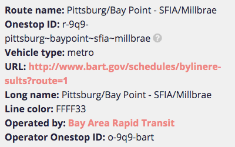

On the sidebar, at the end of the section, there are links to view the Transitland API request and get the result as GeoJSON, which is a geographic data format commonly used with web mapping. For example, the API query for routes operated by BART is https://transit.land/api/v1/routes?&operated_by=o-9q9-bart.

The request for GeoJSON is similar, but includes `geojson` in it: https://transit.land/api/v1/routes.geojson?&operated_by=o-9q9-bart. Later in the tutorial, you will use the GeoJSON URL to draw a custom transit map with Mapzen's Tangram Play map editor.

If you want to interact with these APIs programmatically, looking at the query can help you understand the components and create a properly formatted query that you can save and reuse in other projects that integrate these APIs.

## Get details about a route

When you are displaying routes in the map, you can choose whether to color them based on the mode, such as train or bus, or the operator. Now, you will find a route and get more information about it.

_Tip: Any time you want to start over with your search, click `Show routes` to search within the current map extent._

1. In the search box, type `2201 Broadway, Oakland` and press Enter.
  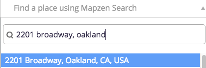
2. Click `Show routes` to see the transit routes near this location. The total number of routes is shown on the drop-down list, and similar to BART, the individual route names are there, too. You can hover over a route on the map for more information.
  Currently, the routes are being drawn in the same color, but you can style them so they are classified by the mode or the operator.
3. Under `Style routes by`, click `Mode`. When you do this, each mode of transit (such as metro, bus, or rail) is drawn with a unique color. Depending on your zoom level, you may not see more than one mode available. If this happens, zoom out slightly and click `Redo search in map area`.
  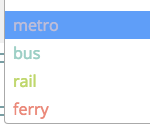
4. Under `Style routes by` click `Operator`. This shows each transit operator in a different color (your colors may vary from those shown in the images here).
5. Hover over route `12` near the address point, and click it on the map (or in the drop-down list) to see its details.
  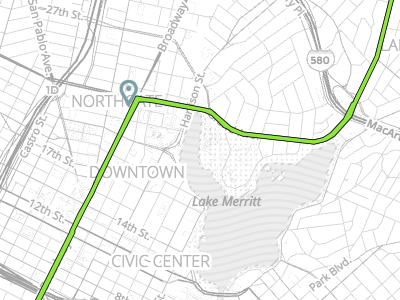
  This is a bus route operated by the Alameda-Contra Costa Transit District, and has a Onestop ID of `r-9q9p3-12`. The Onestop ID starts with the letter `r` to indicate it is a route data entity.
  _Tip: You can query for this route using https://transit.land/api/v1/routes?onestop_id=r-9q9p3-12, which searches for the route's Onestop ID. Use https://transit.land/api/v1/routes.geojson?onestop_id=r-9q9p3-12 to get its GeoJSON._
6. Zoom out so you can see the full extent of this route, which goes between Oakland and the nearby city of Berkeley.
7. Check the box to `Show stops served by this route` to see dots on the map representing bus stops.
  The route line and stops that are displayed by default are a representation of the most common shape of that route. However, a route may be different at certain times, for example, in inbound or return directions, or to consider one-way roads. These differences are known as a [RouteStopPattern](https://transit.land/documentation/datastore/routes-and-route-stop-patterns.html#route_stop_patterns) in the Transitland API.
8. Click the link to `Show route stop patterns` to view the unique combinations of shape lines for trips and stops along this route.
  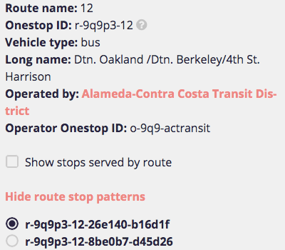
9. Click each of the patterns to view them on the map. For example, you can see segments of the route where there are differences because the road is divided with a median in between lanes.
  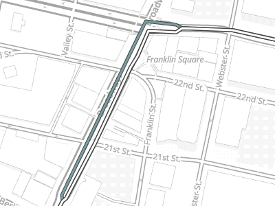

## Explore transit stops near a location

You have explored transit operators and routes, so you will now look at stops.

1. Repeat the search for `2201 Broadway, Oakland` to return to your original location.
2. Under `Visualize public transit networks`, click `Show stops`.
2. Hover over the stop immediately to the east of the marker, which is Broadway and W. Grand Avenue. Click it on the map to display the details about the stop.
  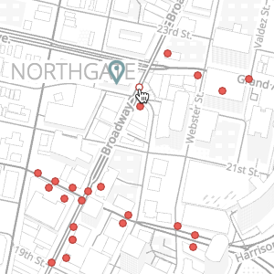

Similar to what you saw for the details of operators and routes, the stop also has a Onestop ID. This time, though, the Onestop ID is `s-9q9p1erf53-broadway~wgrandav`, where the `s` designates it is a transit stop.

You can see a list of the routes that serve this stop, which are different routes that are all from one transit operator. Experiment with clicking the links to see the routes.

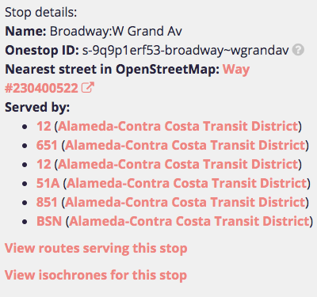

You can get the GeoJSON for this location with a query of https://transit.land/api/v1/stops.geojson?onestop_id=s-9q9p1erf53-broadway~wgrandav.

In this case, Alameda-Contra Costa Transit District is the only operator serving this stop. However, part of the power of Transitland is that it aggregates data from many operators and merges them so they can be queried at the same time.

For example, if you search for stops in downtown San Francisco, there are some locations where two different transit operators (BART and San Francisco Municipal Transportation Agency) have colocated underground metro rail stations, plus there are bus lines and light rail stops on the surface. You can click a shared stop and get information for all the transit options there, even if they are served by different operators.

## View travel times from a location

With a point on the map, either a selected stop or marker from a search, you can see where you can travel within a certain amount of time. You can specify the mode of transportation, such as walking, biking, driving, or taking transit, and see a series of rings to represent where you can reach within various increments of time, ranging from 15 to 60 minutes.

This is known as an isochrone, which is a line that connects points of equal travel time about a given location, from the Greek roots of `iso` for equal and `chrone` for time. Isochrone functionality is also sometimes referred to as a service area, a drive-time analysis to show where you can drive from a point within a certain time, or a walkshed. A walkshed, which is a transportation planning term, calculates an area within a range of a location that can be reached by walking (or a bikeshed for areas that can be traveled by bicycle within those time ranges).

The analysis comes from the [Valhalla Isochrone](https://github.com/valhalla/valhalla-docs/blob/master/isochrone/api-reference.md) service, which you can use as an API in your own apps. In earlier exercises, your requests have been to the Transitland Datastore API, but isochrones use the Mapzen Mobility API. You can also see the Mapzen Mobility API request using the link on the sidebar.

Mapzen Isochrone uses data from [OpenStreetMap](http://www.openstreetmap.org/) to help determine which roads and bicycle paths can be reached.

1. Repeat the search for `2201 Broadway, Oakland` to return to your original location.
2. Under `Analyze access`, click `Generate isochrones`.
3. Click the option for `walking` to see where you can walk from this point.
  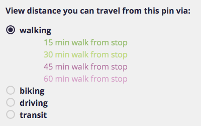
  The map updates to show color-coded rings that represent where you can reach within 15-, 30-, 45-, and 60-minute time increments. You may need to zoom out to see the entire walkshed area.
  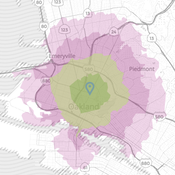
4. Try the biking and driving options to see how the shapes compare to walking. _Note: The driving isochrone map does not [yet](https://mapzen.com/blog/announcing-open-traffic/) consider current traffic conditions._
5. Click `transit` to view where you can travel by transit. By default, isochrones are calculated for the current time.
6. Click the clock button and try changing the departure time to be during workday commute hours, weekends, and after midnight to see the differences.

Typically, transit service is reduced at night and on weekends, so it is likely that the polygons are much smaller then than during working hours.

Notice that there are some areas that are disconnected from the main groupings in Oakland. These rings likely surround train stations or ferry terminals that are geographically distant but within reach of fast transit service.

## See the effect on travel times without certain operators or routes

You can exclude operators and routes to see the effect on the resulting isochrones. You might want to do this to determine what happens if there is a maintenance issue that causes a subway service outage, or an event or a parade that closes a street and buses can no longer run there. In addition, perhaps you have purchased a ticket that is valid on one transit agency, so you want to see where you can travel using only that operator.

1. Make sure you have a point on the map. If not, repeat the search for `2201 Broadway, Oakland` to return to your original location, and click `Generate isochrones`.
2. Click `transit`. Optionally, choose the date and time of your departure, if you want to travel at a time different from the present. _Note: These images reflect travel during a weekday in morning commute hours._
  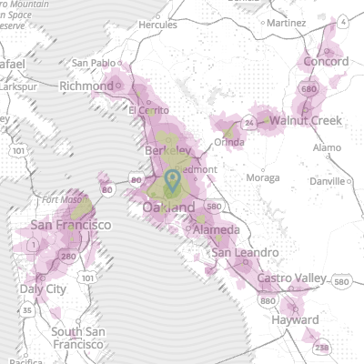
3. Click `Include or exclude operators`.
4. Under the `Exclude` column, check `Bay Area Rapid Transit` to see where you can go without taking BART.
  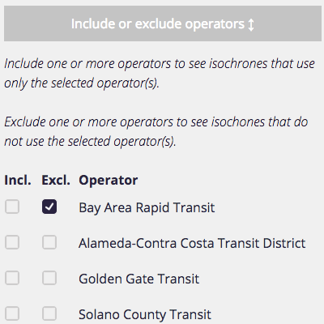
Because BART serves a large regional area, your isochrones are much closer to the starting location.
  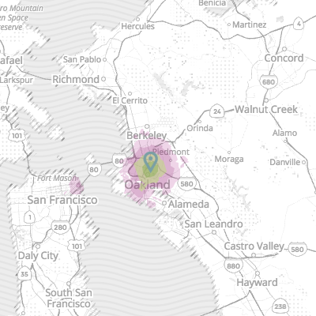
5. Try including or excluding other operators to see the result.
6. Try including or excluding routes, such as `12` or `Pittsburg/Bay Point - SFIA/Millbrae`, by checking the `Exclude` box.

You will likely see a big difference if you turn off `Pittsburg/Bay Point - SFIA/Millbrae` because that is a BART route that extends to the far northeastern part of the region.
  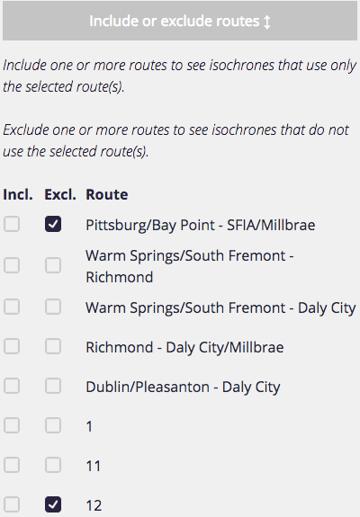

## Make your own transit map with Tangram Play

So far, you have been using Mobility Explorer to query and visualize transit data. While Mobility Explorer lets you ask diverse questions about data, you can display the results of only one query at a time. In addition, the basemap and map symbol colors are already designed for you. If you want to make a truly custom transit map, use the URLs of your queries or GeoJSON files from Mobility Explorer and copy them into an external mapping app.

One mapping app you can use is [Tangram Play](https://mapzen.com/tangram/play/), which is an interactive text editor for Mapzen’s [Tangram](https://mapzen.com/products/tangram/) map engine. Tangram uses a human-readable format called `.yaml` to organize all the styling elements needed to draw a map. This file specifies the source of the data, which layers from that source to display on the map, and rules about how to draw those layers, such as color and line thickness.

With Tangram Play, you can write and edit map styles and preview the changes live in the web browser. Tangram Play has two main interface components: the map preview and the editing pane. The map preview will show any changes made by writing in the editing pane on the fly.

In this exercise, you will open a map with lines representing the transit routes operated by BART.

1. Copy `goo.gl/9immhW` and paste it into the address bar of a new browser tab. This is a shortened link to a Tangram Play map, which opens to display a basemap with several transit-related layers.
  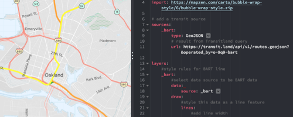
2. Click `Inspect` on the toolbar at the top to enable a mode where you can get attributes about the features you click.
  
3. Hover over features on the map, and click the yellow BART line to see details about it in a pop-up. If you scroll through the list, you see the route line color, Onestop ID, and other properties from the Transitland entity.
  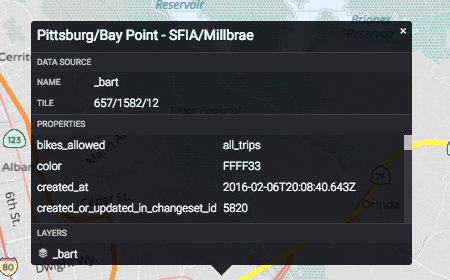
4. Click `Inspect` again to turn off this mode.

## Add a transit route and stop to the map

Under `sources`, notice that the data sources are from URLs that request GeoJSON from the Transitland API. Under `layers`, you define the style rules for how to display those features on the map. For example, the BART route lines are drawn with the route colors from the data in Transitland, which originates from the GTFS file. This color information is created using a special JavaScript function that enables advanced drawing capabilities.

To customize the map, you will add a line representing bus route 12 that you viewed in Mobility Explorer, as well as a point for the bus stop along Broadway.

_Tip: You can find a completed version of the YAML file at the end of this page._

1. Within the `sources` block, after the `_bart` block, paste the following YAML text. The URL is a Transitland query for the Onestop ID of bus route 12.
  ```yaml
  _bus12:
    type: GeoJSON
    #result from Transitland query
    url: https://transit.land/api/v1/routes.geojson?onestop_id=r-9q9p3-12
  ```
  The underscore in front of `_bus12` is a Tangram best practice to indicate that the name is a user-generated variable, compared to syntax required by Tangram.
  _Tip: Be careful to follow the proper indentation levels as you paste; there are vertical guidelines to help you. You can also select multiple lines and press the Tab key to indent them all at once._
2. Scroll the YAML to the end. Within the `layers` block, after the `_bart` block, paste this text to define how to style the bus route line.
```yaml
  _bus12:
    data:
        source: _bus12
    draw:
        #style this data as a line feature
        lines:
            #add line width
            width: 5px
            #define the color
            color: blue
            #add order to draw on top of basemap
            order: 1005
```
The map should look something like this:
  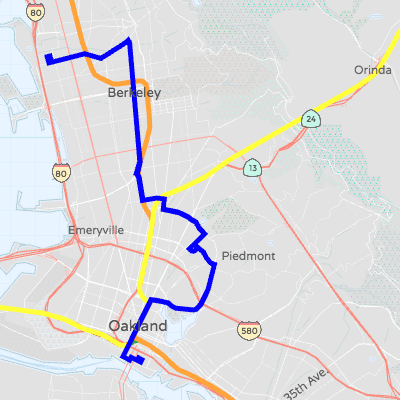
3. Optionally, modify the line width or color to change how the bus line is displayed on the map. You can open a color picker, or use any of the other [ways of specifying a color](https://mapzen.com/documentation/tangram/draw/#color).
  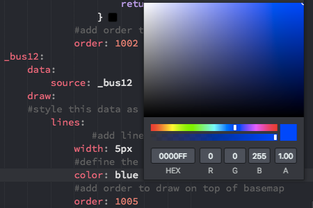
Next, you can add a point representing the bus stop along Broadway that you mapped earlier.
4. Within the `sources` block, after the `_bus12` block that you added, paste in this query for that stop.
```yaml
  _stopBroadway:
    type: GeoJSON
    url: https://transit.land/api/v1/stops.geojson?onestop_id=s-9q9p1erf53-broadway~wgrandav
```
5. As you did before, within the `layers` block, after the `_bus12` block, paste this text to define how to style the point. A higher `order` value means this point is drawn on top of others.
```yaml
  _stopBroadway:
    data:
        source: _stopBroadway
    draw:
      #style this data as a point feature
        points:
          # add a color and size (in pixels)
            color: red
            size: 24px
            order: 2000
```
6. Optionally, continue adding data layers to your map and setting their display properties. When copying the API requests from Mobility Explorer, make sure you use the URL for the GeoJSON response so it displays on a map.
7. When you are done, click `Save` to download the YAML file so you can re-create your map in the future. You can also sign in to your Mapzen account (after [creating one](https://mapzen.com/documentation/overview/), if needed) and save the map to your Mapzen account.

## Tutorial summary

You have explored transit data, including its operators, routes, and stops. You also calculated how far you can travel from a particular location by creating an isochrone map. You also have experimented with the map styles using Tangram Play to customize your transit map.

If you want to learn more, review the [Transitland documentation](https://transit.land/documentation/) and the [Valhalla API documentation](https://github.com/valhalla/valhalla-docs).

The Transitland project is open source, so you are encouraged to get involved by submitting suggestions or even contributing code: https://github.com/transitland. In addition, if you know of public GTFS feeds that are not currently part of Feed Registry, please [submit](https://transit.land/feed-registry/feeds/new) them.

## Data credits

The images are from Mobility Explorer, which includes data from [Transitland](https://transit.land) and [OpenStreetMap](http://www.openstreetmap.org/).

## Completed YAML for Tangram Play

The completed YAML for the basic transit map should look something like this:

```yaml
# Supplemental file for Mobility Explorer tutorial: https://mapzen.com/documentation/mobility/explorer/tutorial/

# imports the Bubble Wrap map style
import: https://mapzen.com/carto/bubble-wrap-style/6/bubble-wrap-style.zip

# add a transit source
sources:
    _bart:
        type: GeoJSON
        # result from Transitland query
        url: https://transit.land/api/v1/routes.geojson?&operated_by=o-9q9-bart
    _bus12:
        type: GeoJSON
        #result from Transitland query
        url: https://transit.land/api/v1/routes.geojson?onestop_id=r-9q9p3-12
    _stopBroadway:
        type: GeoJSON
        url: https://transit.land/api/v1/stops.geojson?onestop_id=s-9q9p1erf53-broadway~wgrandav
layers:
    #style rules for BART line
    _bart:
        #select data source to be BART data
        data:
            source: _bart
        draw:
            #style this data as a line feature
            lines:
                #add line width
                width: 5px
                #add color (can be in RGB, HEX, or HTML color codes)
                color: |
                    function() {
                        return '#'+feature.color;
                    }
                #add order to draw on top of basemap
                order: 1004
    _bus12:
        data:
            source: _bus12
        draw:
            #style this data as a line feature
            lines:
                #add line width
                width: 5px
                #define the color
                color: blue
                #add order to draw on top of basemap
                order: 1005
    _stopBroadway:
        data:
            source: _stopBroadway
        draw:
            #style this data as a point feature
            points:
              # add a color and size (in pixels)
                color: red
                size: 24px
                order: 2000
```
